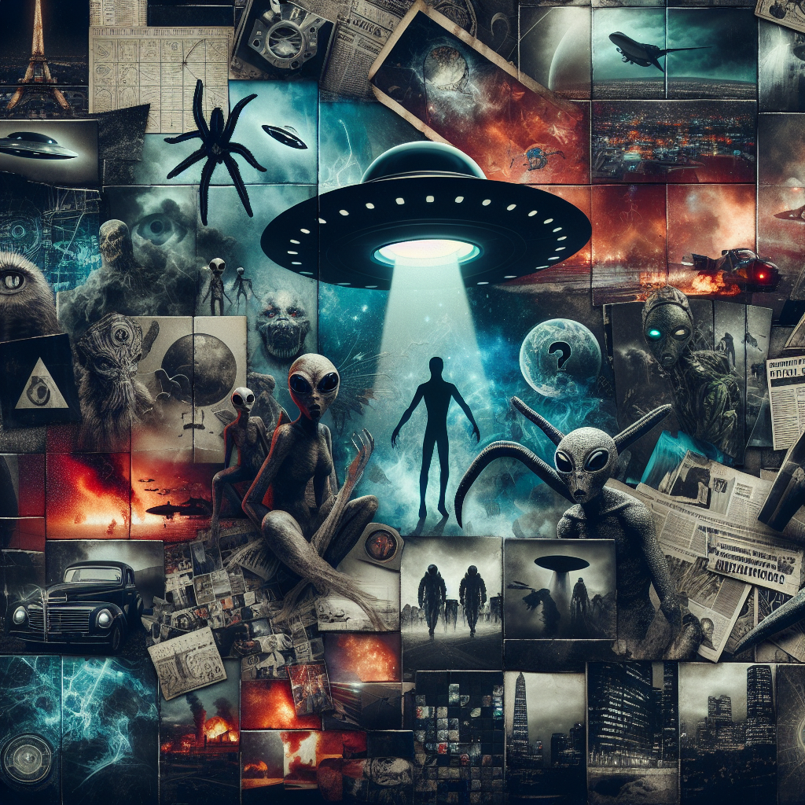

_This is a submission for the [Web Game Challenge](https://dev.to/challenges/webgame), Build a Game: Alien Edition_

## What I Built
A L I E N - S O L I T A R E 
_powered by jsdoc-duck_



**Technical Achievement:** I created a small jsDoc source React state handling npm module called: [jsdoc-duck](https://www.npmjs.com/package/jsdoc-duck) but until now I don't write any example application for it, I think this Challange is a right time for do it, and proof my module concept are working. Also proof the jsDoc working fine, and usable to typesafe JS coding without TypeScript.

**Plagiarism:** Saddly my time is very limited, so a first moment I write down the base concept to my phone meanwhile of passenger of country drive ( 2hr ) in temux and vim. My plane was 2 or 3 day development time is need to be enough, but I am not the fastes developer. That why I choose this game method which is very lovely, mid complex, used by: [Card Crawl - base idea](https://play.google.com/store/apps/details?id=com.tinytouchtales.cardcrawl&hl=en_US), reworked that game mechanism to Alien theme.

Instead CSS I using **Tailwind**, but for simplify it is directly linked to html as cdn:
```html
<script src="https://cdn.tailwindcss.com"></script>
```

**Art:** A previous year I spended to create many (60K+) AI generated images with (dream.ai, clipDrop, ChatGPT) , so I have enough Sci-Fi related which is handy for this game.

## Demo
<!-- You can directly embed your game and code into this post (see the FAQ section of the challenge page) or you can share links to your game and public repo. -->



## Journey
<!-- Tell us about your process, what you learned, anything you are particularly proud of, what you hope to do next, etc. -->

<!-- We encourage you to consider adding a license for your code. -->

<!-- Team Submissions: Please pick one member to publish the submission and credit teammates by listing their DEV usernames directly in the body of the post. -->

<!-- Don't forget to add a cover image (if you want). -->

<!-- Thanks for participating!  -->


```
[    ][    ][     ][         ] <- 4 possible card draw from deck
[item][hero][alien][spaceship] <- hero have solution points 
```

Hostile: problem

Game win if hero left some solution pont. Alien give advice against problem,

Qualify the problem:
  -technical
  -phisical
  -combat

A certain point I was write down core mechanism with random script 
```
  [ possible drag-to interaction ]

  switch card:dark from slot:LINE
    drag-to target.slot:[HERO,ACTIVE]
      if target.card != HERO && target.card:PROTECT
        taget.card.pow -=0=- card.pow
          - target.card may drop
          - card may drop
  if card:dark.power:left > 0 coniue on next entry

  drag-to target.slot:[HERO,ACTIVE:empty]
      target.card.pow -=0=- hero.pow
        - target.card may drop
        - hero may drop -> lose the game: THE_END

  switch card:light from slot:LINE
    drag-to target.slot:ACTIVE:empty
      then deploy
    drag-to target.slot:STORE:empty
      then deploy

  switch card:light from slot:STORE
  drag-to target.slot:ACTIVE:empty
    then deploy

  switch card:light from slot:ACTIVE
    if card:light:CAUSE
      drag-to target.slot.LINE:card.dark
        target.card.pow -=0=- card:light.pow
          - may card:light drop
          - may target.card drop

    if card:light:SKILL
      drag-to target.slot:HERO
        then use SKILL on HERO
      drag-to target.slot:LINE:card
        then use SKILL on target card in line
      darg-to target.slot:ACTIVE:card
        then use SKILL on target card in active
      drag-to target.slot:STORE:card
        then use SKILL on target card in store

  [ on drop card check ]

  drop HERO
    THE_END

  drop any card chek the LINE(s)
  if only 1 LINE have card
    RELEASE_CARD as many LINE:empty left, max SECENE.length

  if SCENE:empty then play until all LINE card are played

  if SCENE:empty and LINEs:empty and HERO.pow > 0
    then HAPPY_END
```

How controll the complex state animation game flow interaction process by react.

interaction : action :
  calc phase1 result
  animate phase1 result
  action: set endof phase1 state

```js
// interaction generate a DRAG_TO action
quak.DRAG_TO({card, slot})

// make a Stream entry which are descript the upcomming animations
quak.ANIM([
  drop(slot.card),
  reducePower(card),
  reducePower(hero),
  drop(card),
  checkReleaseOrInteraction(),  
])

quak.PREPARE_ANIM, quak.ADD_ANIM, quak.PLAY_ANIM

// later if have a stream and onPlay

useEffect(() => {
  if(stream.length && onPlay) 
   play(stream)
,[stream, onPlay]})
```

## Truble of creation

Harder to download my dreams.ai images, maybe need to create a proper nodejs server for that or using some test library

Different aspect ratio images can cause trouble.